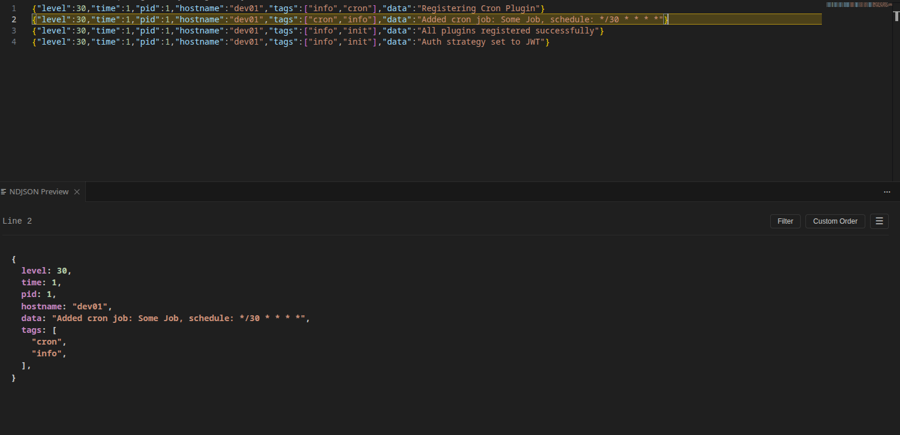

# NDJSON Preview

A powerful VS Code extension for viewing and analyzing NDJSON (Newline Delimited JSON) files with syntax highlighting, filtering, and custom ordering capabilities.



## Features

### 📊 Live Preview with Syntax Highlighting
- **Side-by-side view**: See pretty-printed JSON in a preview panel as you navigate through your NDJSON file
- **Syntax highlighting**: Color-coded JSON with distinct colors for keys, strings, numbers, booleans, and null values
- **Auto-updates**: Preview automatically updates as you move your cursor to different lines
- **Line highlighting**: Current line is highlighted in the editor for easy tracking

### 🔍 Advanced Filtering
- **Filter by key-value pairs**: Show only lines that match specific criteria
- **Nested key support**: Use dot notation (e.g., `user.email`, `address.city`) to filter on nested properties
- **Multiple filters**: Apply multiple filters with AND logic - lines must match all filters
- **Filtered view**: Creates a new editor tab showing only matching lines, perfect for large files
- **Visual feedback**: Shows count of matching lines (e.g., "Showing 45 of 1000 lines")

### 🔧 Custom JSON Ordering
- **Reorder Keys toggle**: Automatically sort JSON keys with primitives first, then objects/arrays
- **Custom ordering**: Define your own key order - specify which keys should appear first
- **Persistent preferences**: Custom order is saved globally and remembered between sessions
- **Nested ordering**: Ordering rules apply recursively to nested objects

## Installation

### From VSIX (Local Installation)
1. Download the `.vsix` file
2. Open VS Code
3. Go to Extensions (`Ctrl+Shift+X` / `Cmd+Shift+X`)
4. Click the `...` menu → "Install from VSIX..."
5. Select the downloaded file

### From VS Code Marketplace
1. Open VS Code
2. Go to Extensions (`Ctrl+Shift+X` / `Cmd+Shift+X`)
3. Search for "NDJSON Preview"
4. Click Install

## Usage

### Basic Usage

1. **Open an NDJSON file** (`.ndjson` or `.jsonl`)
2. **Preview opens automatically** in a side panel
3. **Navigate lines** - The preview updates as you move your cursor

### Filtering Lines

1. Click the **"Filter"** button in the preview panel
2. Enter a **key** (e.g., `status` or `user.name` for nested keys)
3. Enter the **value** to match
4. Click **"Add"** or press Enter
5. Add more filters if needed
6. Click **"Apply"**

A new editor tab opens showing only lines that match all your filters. Click "Clear All" to remove filters and close the filtered view.

**Example filters:**
- `status` = `active` - Show only lines where status equals "active"
- `user.role` = `admin` - Show lines where user.role equals "admin"
- Multiple filters: `type` = `order` AND `status` = `completed`

### Custom Key Ordering

#### Using the Reorder Toggle
Click the **"Reorder Keys"** toggle to automatically organize JSON with:
- Primitive values (strings, numbers, booleans, null) first
- Objects and arrays last

#### Using Custom Order
1. Click the **"Custom Order"** button
2. Enter one key per line in your desired order:
   ```
   id
   name
   email
   status
   ```
3. Click **"Apply"**

Keys will appear in the order you specified, followed by any remaining keys. This preference is saved globally.

## Keyboard Shortcuts

In the filter modal:
- **Enter** in the key field - Move to value field
- **Enter** in the value field - Add the filter
- **Esc** - Close modal (click outside also works)

## File Format

The extension works with NDJSON (Newline Delimited JSON) files where each line contains a valid JSON object:

```json
{"id":1,"name":"Alice","age":30,"city":"New York","status":"active"}
{"id":2,"name":"Bob","age":25,"city":"Boston","status":"inactive"}
{"id":3,"name":"Charlie","age":35,"city":"Chicago","status":"active"}
```

Supported file extensions:
- `.ndjson`
- `.jsonl`

## Configuration

### Global Settings
- **Custom Order**: Saved globally in VS Code's global state
- Persists across sessions and workspaces

### Per-Session Settings
- **Filters**: Reset when the preview panel is closed
- **Reorder Keys toggle**: Reset when the preview panel is closed

## Use Cases

### Log Analysis
Filter server logs by status code, user ID, or error type:
```
{"timestamp":"2024-01-15","level":"error","user_id":"123","message":"..."}
{"timestamp":"2024-01-15","level":"info","user_id":"456","message":"..."}
```
Filter: `level` = `error` to see only error logs

### Data Exploration
Explore large datasets by filtering on specific attributes:
```
{"product":"laptop","category":"electronics","price":999,"stock":50}
{"product":"desk","category":"furniture","price":299,"stock":12}
```
Filter: `category` = `electronics` to view only electronics

### API Response Analysis
Analyze API responses with consistent key ordering:
```
{"id":1,"data":{...},"metadata":{...},"status":"success"}
```
Custom order: `id`, `status`, `data`, `metadata`

## Performance

- **Efficient filtering**: Handles files with thousands of lines
- **Lazy rendering**: Preview only renders the current line
- **Lightweight**: No heavy dependencies, uses VS Code's native capabilities

## Development

### Building from Source

```bash
# Clone the repository
git clone https://github.com/yourusername/ndjson-preview.git
cd ndjson-preview

# Install dependencies
npm install

# Compile
npm run compile

# Run in development mode (Press F5 in VS Code)
```

### Project Structure

```
ndjson-preview/
├── src/
│   └── extension.ts    # Main extension code
├── package.json        # Extension manifest
├── tsconfig.json       # TypeScript configuration
└── README.md          # This file
```

## Contributing

Contributions are welcome! Please feel free to submit a Pull Request.

## Known Issues

- Filtered view creates a new untitled document - changes to this document are not saved
- Very large JSON objects (>1MB per line) may cause performance issues in the preview

## License

MIT

## Release Notes

### 1.0.0

Initial release with:
- Live preview with syntax highlighting
- Line-by-line navigation
- Filter by key-value pairs
- Custom key ordering
- Nested key support with dot notation
- Persistent global preferences

## Credits

- Built with [pretty-print-json](https://www.npmjs.com/package/pretty-print-json) for syntax highlighting
- Developed for the VS Code community

## Feedback & Support

- **Issues**: [GitHub Issues](https://github.com/yourusername/ndjson-preview/issues)
- **Feature Requests**: [GitHub Discussions](https://github.com/yourusername/ndjson-preview/discussions)

---

**Enjoy analyzing your NDJSON files!** 🚀